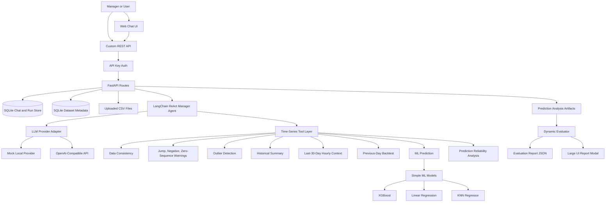

# Agentic Time Series Analysis

An agentic AI application for analyzing time series data, generating ML forecasts, explaining forecast reliability, and evaluating the quality of the agent's own prediction-analysis answers.

The project is designed as an AI engineering portfolio project. It combines a ReAct-style LLM manager agent, deterministic time-series tools, simple ML forecasting models, temporal anti-leakage controls, chat memory, API access, a web interface, and an evaluator workflow.

## Highlights

- ReAct-style manager agent built with LangChain `create_agent`.
- Provider-neutral LLM layer with mock local mode and OpenAI-compatible API support.
- FastAPI backend with API-key protection.
- Simple web chat interface for uploading CSV files and talking to the agent.
- SQLite persistence for datasets, chats, messages, predictions, and agent runs.
- Time-series tools for data quality, anomalies, outliers, historical summaries, hourly context, predictions, backtests, and prediction reliability.
- Three publishable ML models: XGBoost, linear regression, and KNN regressor.
- Temporal cutoff rule to prevent future-data leakage.
- Dynamic evaluator that scores the manager's prediction-analysis answer against held-out actual values.
- Manual agent planning evals for checking intent and tool selection.

## Demo Video

**Watch the demo video:** [Open the Google Drive demo](https://drive.google.com/file/d/1STgNfSmY_60MbMGveou4V-_FbFRPzaf_/view?usp=sharing)

Raw link:

```text
https://drive.google.com/file/d/1STgNfSmY_60MbMGveou4V-_FbFRPzaf_/view?usp=sharing
```

## Architecture



## How The Agent Works

The app uses one main manager agent. The manager receives the user's message, recent chat history, request metadata, and a catalog of available tools.

The manager decides whether the question is:

- a general concept question,
- a dataset quality question,
- an outlier/anomaly question,
- a historical analysis question,
- a forecast/prediction reliability question,
- or a historical model-performance question.

For dataset and prediction questions, the manager uses tools through a ReAct loop:

```text
Think about the user request
-> choose one or more tools
-> observe tool results
-> call more tools if needed
-> write a short manager-friendly answer
```

The agent does not directly manipulate data by guessing. The data work is done by deterministic Python tools, and the LLM explains the result in simple language.

## Main Components

| Area | Files | Purpose |
| --- | --- | --- |
| API | `app/api/routes.py` | Dataset upload, chat, models, dynamic evaluation endpoints |
| Agent | `app/agents/workflow.py` | LangChain ReAct agent setup and tool execution |
| Prompts | `app/agents/prompts.py` | Manager system prompt and tool catalog |
| LLM adapter | `app/llm/langchain_adapter.py` | Mock and OpenAI-compatible chat model adapter |
| Time-series tools | `app/tools/time_series.py` | Quality checks, anomalies, outliers, summaries, hourly context |
| Prediction tools | `app/tools/predictions.py` | Forecasting, backtesting, model performance, reliability analysis |
| ML models | `app/ml_models/simple_forecasters.py` | XGBoost, linear regression, KNN forecasting models |
| Persistence | `app/services/*.py` | SQLite chat/dataset storage and evaluation artifacts |
| Frontend | `app/static/` | Simple browser chat interface |
| Planning evals | `agent_planning_evals/` | Manual checks for expected intent/tool selection |

## Technologies Used

- Python 3.11+
- FastAPI
- Uvicorn
- LangChain
- Pandas
- NumPy
- scikit-learn
- XGBoost
- SQLite
- HTML, CSS, JavaScript
- Pytest

## Installation

Clone the project, then create and activate a virtual environment.

```powershell
python -m venv env
.\env\Scripts\activate
```

Install dependencies:

```powershell
.\env\Scripts\python.exe -m pip install -r requirements.txt
```

Create a local `.env` file from the example:

```powershell
Copy-Item .env.example .env
```

The app automatically loads `.env` from the project root when it starts. It works without a real LLM key because the default provider can be the mock provider. To use a real LLM, configure `.env` as described below.

## Environment Variables

Example:

```text
APP_NAME=Agentic Time Series Analysis API
API_KEYS=dev-api-key
DATABASE_PATH=app_data/agent_api.sqlite3
UPLOAD_DIR=app_data/uploads
DEFAULT_LLM_PURPOSE=agent
```

Optional OpenAI-compatible provider:

```text
LLM_API_KEY=your-key-here
LLM_PROVIDERS_JSON={"agent":{"provider":"openai_compatible","model":"your-model-name","api_key_env":"LLM_API_KEY","base_url":"https://api.openai.com/v1","temperature":0.2,"max_tokens":3000}}
```

Any OpenAI-compatible endpoint can be used, including OpenRouter-style endpoints, as long as it follows the chat completions format.

## Run The App

Start the API and web interface:

```powershell
.\env\Scripts\python.exe -m uvicorn app.main:app --reload --host 127.0.0.1 --port 8000
```

Open:

```text
http://127.0.0.1:8000/
```

API docs:

```text
http://127.0.0.1:8000/docs
```

Default API key:

```text
dev-api-key
```

## Example Dataset

A small synthetic publishable dataset is included:

```text
example_data/example_energy_timeseries.csv
```

It has the required format:

```csv
timestamp,value
2026-01-01 00:00:00,1180
```

## Using The Web Interface

1. Open `http://127.0.0.1:8000/`.
2. Keep the API key as `dev-api-key` or enter your configured key.
3. Click `New Chat`.
4. Upload `example_data/example_energy_timeseries.csv` or your own CSV.
5. Select a model such as `linear_regression_simple`.
6. Enter a start and end range if asking for forecasts or model performance.
7. Ask the agent a question.
8. Inspect intent, tools, and trace in the right panel.
9. For prediction-analysis answers, click `Evaluate Latest` to score the answer.

## Using The API

Upload a CSV:

```powershell
curl -X POST "http://127.0.0.1:8000/v1/datasets/upload" `
  -H "X-API-Key: dev-api-key" `
  -F "file=@example_data/example_energy_timeseries.csv"
```

Create a chat:

```powershell
curl -X POST "http://127.0.0.1:8000/v1/chats" `
  -H "X-API-Key: dev-api-key"
```

Send a message:

```powershell
curl -X POST "http://127.0.0.1:8000/v1/chats/YOUR_THREAD_ID/messages" `
  -H "X-API-Key: dev-api-key" `
  -H "Content-Type: application/json" `
  -d '{
    "message": "Generate a forecast and explain if it looks reliable or risky.",
    "dataset_id": "YOUR_DATASET_ID",
    "model_name": "linear_regression_simple",
    "forecast_start": "2026-01-03 00:00:00",
    "forecast_end": "2026-01-03 23:00:00",
    "sample_rate_seconds": 3600
  }'
```

## Supported ML Models

The public app uses only these three simple models:

| Model name | Technique | Description |
| --- | --- | --- |
| `xgboost_simple` | XGBoost regressor | Nonlinear tree-based model using calendar/time features |
| `linear_regression_simple` | Linear regression | Fast baseline using trend and calendar/time features |
| `knn_regressor_simple` | KNN regressor | Neighbor-based model using similar time-feature patterns |


## Available Tools

The manager agent can call these tools:

- `data_consistency`: missing values, duplicate timestamps, gaps, irregular steps.
- `data_anomaly_warnings`: huge jumps, negative values, long zero-value sequences.
- `outlier_detection`: statistically unusual points.
- `historical_summary`: trend, average, min, max, high/low hours.
- `hourly_consumption_context`: recent same-hour behavior from the last 30 historical days.
- `prediction_backtest_context`: previous-day model performance before a forecast.
- `prediction`: forecast generation with the selected ML model.
- `prediction_analysis`: reliability analysis for each predicted hour.
- `model_performance_analysis`: model accuracy on a historical range with actual values.
- `prediction_interval`: placeholder for interval source integration.

## Temporal Cutoff Rule

When `forecast_start` is provided, the app simulates what would have been known at that time.

- Context tools use only rows before `forecast_start`.
- New predictions are generated using only rows before `forecast_start`.
- Previous-day backtesting predicts the previous day using only data before that previous-day window.
- Historical model-performance analysis predicts the requested range using only data before the range start, then compares with actuals inside the range.
- Rows after the requested range are ignored.

This protects the agent evaluation from future-data leakage.

## Chat Memory

Chats are stored in SQLite. Each thread has a `thread_id`, and recent messages are passed back into the manager agent as conversation context.

This lets the user continue a conversation instead of starting from scratch every time.

## Prediction Analysis Artifacts

When the manager answers a prediction-analysis question, the app saves a JSON artifact:

```text
app_data/manager_prediction_evals/YYYY-MM-DD__DATASET_ID__MODEL_NAME.json
```

The artifact contains:

- user request,
- manager answer,
- detected intent,
- tools and trace,
- prediction values,
- held-out actual values collected after the answer,
- expected intent and required tool names for deterministic scoring.

The held-out actuals are not shown to the manager before it answers.

## Dynamic Evaluator

After a prediction-analysis answer, click `Evaluate Latest` in the UI.

The evaluator:

1. Loads the saved prediction-analysis artifact.
2. Compares prediction values with held-out actual values.
3. Computes metrics such as MAE, MAPE, bias, worst hours, and high-error count.
4. Scores the manager answer out of 100.
5. Optionally asks the configured LLM for a short qualitative evaluator verdict.
6. Saves an evaluation report.

Evaluation reports are saved here:

```text
app_data/manager_prediction_evals/evaluations/
```

Scoring:

| Category | Points |
| --- | ---: |
| Expected intent and required tool use | 20 |
| Reliability judgment vs actual high-error hours | 30 |
| Grounding in tool outputs | 20 |
| Temporal fairness | 10 |
| Clear manager-friendly communication | 20 |

## Manual Agent Planning Evals

The folder `agent_planning_evals/` contains manual developer checks for ReAct planning.

These evals check:

- Did the manager choose the expected intent?
- Did it call the expected tools?
- Did a general question avoid unnecessary tools?

Run:

```powershell
.\env\Scripts\python.exe agent_planning_evals\run_evals.py
```

These are different from the UI evaluator. Planning evals test tool selection. The UI evaluator scores one real prediction-analysis answer.

Planning evals use the mock LLM provider by default so the expected tool-selection checks are deterministic.

## Example Questions To Ask

### General Question

No dataset is needed for this question.

```text
What is a time series outlier? Explain it simply.
```

Expected behavior:

- If no `dataset_id` is attached, no dataset tools should be needed and the intent should be `general_question`.
- If a `dataset_id` is attached, the manager may use dataset tools to connect the general explanation to the uploaded data. In that case, the intent may become a dataset-related intent such as `data_quality` or `outlier_analysis`.

### Data Quality

Use a `dataset_id`.

```text
Check this dataset for missing values, gaps, duplicate timestamps, negative values, huge jumps, and long zero sequences.
```

Expected tools:

```text
data_consistency
data_anomaly_warnings
```

### Outlier Analysis

Use a `dataset_id`.

```text
Find unusual values or outliers in this dataset. Tell me the exact timestamps I should inspect.
```

Expected tools:

```text
data_consistency
data_anomaly_warnings
outlier_detection
```

### Historical Analysis

Use a `dataset_id`.

```text
Summarize the historical behavior of this time series. Is it increasing, decreasing, or stable?
```

Expected tools:

```text
historical_summary
hourly_consumption_context
```

### Forecast Analysis

Use `dataset_id`, `model_name`, `forecast_start`, and `forecast_end`.

```text
Generate a forecast for this range and explain if the prediction looks reliable or risky.
```

Expected tools:

```text
prediction_backtest_context
prediction
prediction_analysis
```

### Model Performance On Known Actuals

Use a historical range where actual values exist.

```text
How accurate was the ML model on this historical range? Show me MAE, MAPE, and the worst errors.
```

Expected tool:

```text
model_performance_analysis
```

## Suggested Demo Flow

1. Start the app.
2. Open the web interface.
3. Upload `example_data/example_energy_timeseries.csv`.
4. Ask the data-quality question.
5. Ask the historical-analysis question.
6. Choose `linear_regression_simple`.
7. Enter a historical range from inside the dataset.
8. Ask the model-performance question.
9. Enter a forecast range.
10. Ask the forecast-analysis question.
11. Click `Evaluate Latest`.
12. Open the evaluation report.

## Run Tests

```powershell
.\env\Scripts\python.exe -m pytest -q
```

Run planning evals:

```powershell
.\env\Scripts\python.exe agent_planning_evals\run_evals.py
```

## Project Status

This project is a working local prototype for agentic time-series analysis and evaluation. It is suitable for demonstrating:

- LLM tool use,
- ReAct-style agent design,
- ML forecasting integration,
- agent observability,
- dynamic agent evaluation,
- time-series anti-leakage controls,
- and API-first product thinking.
